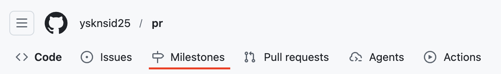

# GitHub Milestones Tab

GitHubのリポジトリページのナビゲーションに「Milestones」タブを追加するChrome拡張機能です。

## 機能

- IssuesタブのすぐあとにMilestonesタブを追加
- GitHubの標準的なアイコンとスタイルを使用

## インストール方法

1. このリポジトリをクローンまたはダウンロード
2. Chromeで `chrome://extensions/` を開く
3. 右上の「デベロッパーモード」を有効にする
4. 「パッケージ化されていない拡張機能を読み込む」をクリック
5. このフォルダを選択

## 使い方

インストール後、GitHubのリポジトリページ（例: https://github.com/ysknsid25/pr）にアクセスすると、IssuesタブのあとにMilestonesタブが自動的に表示されます。
